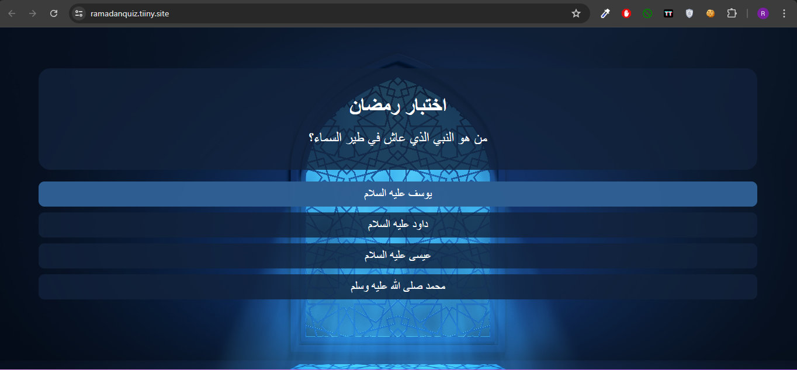

# Ramadan Quiz Website

This project is a website designed to educate and entertain users during the holy month of Ramadan. It features a quiz that tests users' knowledge about Ramadan, its rituals, history, and cultural significance. The quiz includes multiple-choice questions with informative feedback to enhance learning.

## Key Features:
- Interactive quiz with multiple-choice questions.
- Informative feedback for each question.
- User-friendly interface suitable for all ages.
- Educational content about Ramadan and Islamic traditions.

## Technologies Used:
- **Frontend:** HTML, CSS, JavaScript

## Getting Started:
To run the project locally just Download the zib folder extract it .

## Demo:
Check out the live demo [here](https://ramadanquiz.tiiny.site/).

## Contributors:
- Rani Ghazi

Feel free to explore, contribute, and share this project to promote cultural understanding and learning during Ramadan.
